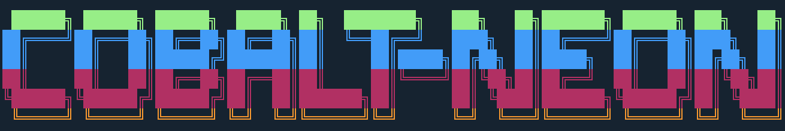
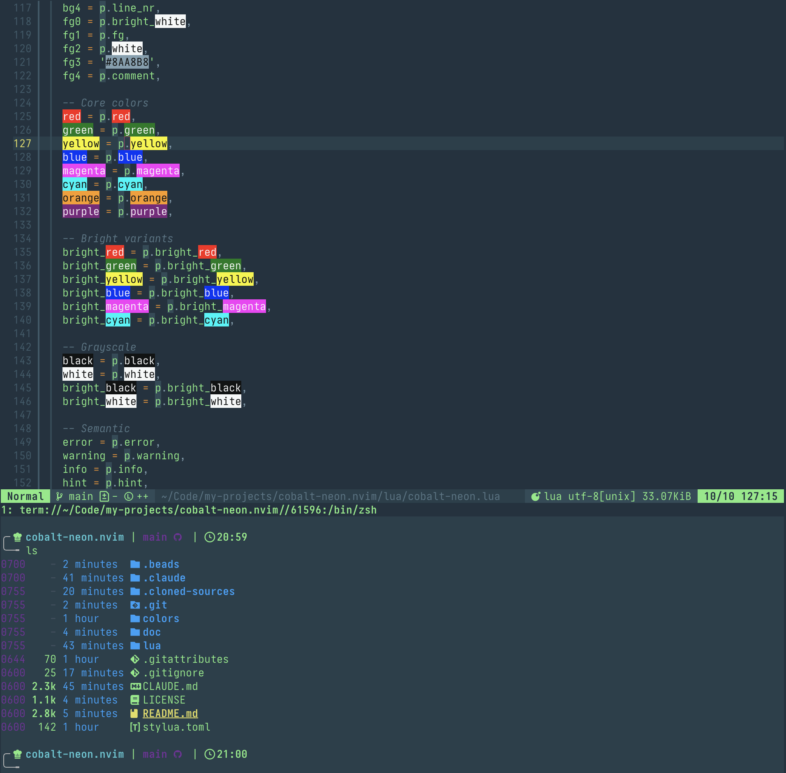

# cobalt-neon.nvim



A cyberpunk Neovim colorscheme based on the Cobalt Neon iTerm2 theme, with fixed ANSI semantics and comprehensive plugin support.



## Features

- Dark theme with neon green foreground and deep blue background
- Fixed ANSI color semantics (original had green as blue, magenta as white, etc.)
- Full Treesitter and LSP semantic token support
- Plugin support: Telescope, Mini.nvim, Gitsigns, Neogit, Blink.cmp, Neo-tree, Which-key, Trouble ...
- Configurable: transparent mode, italics, bold, custom overrides

## Installation

### lazy.nvim

```lua
{
  "kylesnowschwartz/cobalt-neon.nvim",
  lazy = false,
  priority = 1000,
  config = function()
    require("cobalt-neon").setup({
      -- your options here
    })
    vim.cmd.colorscheme("cobalt-neon")
  end,
}
```

### packer.nvim

```lua
use {
  "kylesnowschwartz/cobalt-neon.nvim",
  config = function()
    require("cobalt-neon").setup()
    vim.cmd.colorscheme("cobalt-neon")
  end,
}
```

## Configuration

Default options:

```lua
require("cobalt-neon").setup({
  terminal_colors = true,   -- Set terminal ANSI colors
  transparent_mode = false, -- Transparent background
  dim_inactive = false,     -- Dim inactive windows
  undercurl = true,         -- Use undercurl for diagnostics
  underline = true,         -- Use underline
  bold = true,              -- Use bold

  italic = {
    strings = false,
    comments = true,
    keywords = false,
    functions = false,
    variables = false,
  },

  palette_overrides = {},   -- Override specific palette colors
  overrides = {},           -- Override specific highlight groups
})
```

### Palette Overrides

Override specific colors in the palette:

```lua
require("cobalt-neon").setup({
  palette_overrides = {
    bg = "#0D1E28",        -- Darker background
    green = "#00FF00",     -- Different green
  },
})
```

### Highlight Overrides

Override specific highlight groups:

```lua
require("cobalt-neon").setup({
  overrides = {
    Comment = { fg = "#7A9AAA", italic = true },
    Function = { bold = false },
  },
})
```

## Palette

 | Color      | Hex       | Description              |
 | -------    | -----     | -------------            |
 | Background | `#142838` | Deep blue                |
 | Foreground | `#8FF586` | Neon green               |
 | Red        | `#FF231F` | Bright red               |
 | Green      | `#8FF586` | Neon green               |
 | Yellow     | `#E9E75C` | Warm yellow              |
 | Blue       | `#3BA5FF` | Bright blue              |
 | Magenta    | `#781AA0` | Deep purple              |
 | Cyan       | `#5FCED8` | Teal cyan                |
 | Orange     | `#FF9D00` | Warm orange              |
 | Purple     | `#C4206F` | Hot pink (cursor/accent) |

## License

MIT
